# lard84

A custom 75% ansi low-profile keyboard.

- [PCB](#pcb)
- [Plate](#plate)
- [Case](#case)
- [Acknowledgments](#acknowledgments)
- [Extra pictures](#extra-pictures)

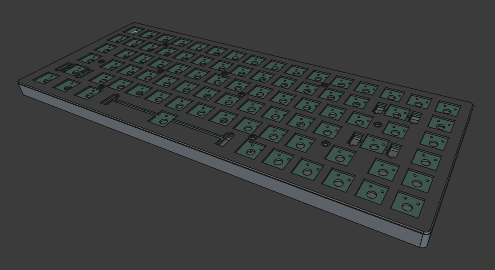

The assembly is done in (sort of) [sandwich mount style](https://thomasbaart.nl/2019/04/07/cheat-sheet-custom-keyboard-mounting-styles/).
Compared to sandwich mount, there is no top frame (the plate sits at the top), and
it is screwed into the case's mounting posts from above.

Here it is finally assembled:
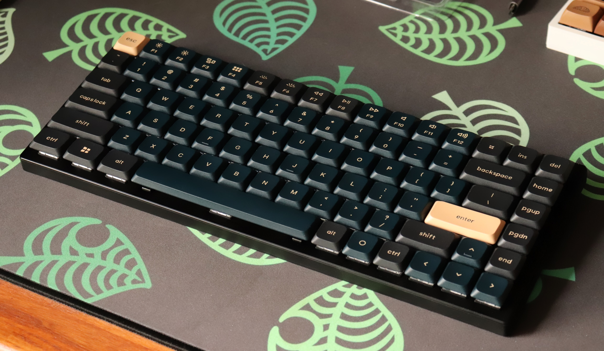

## PCB

The PCB (lard84.kicad_pro) is an 84-key design based on the [RP2350 Stamp](https://lectronz.com/products/rp2350-stamp), made using KiCad 8.0.
It is entirely hand-solderable (smallest footprint is 0603).

The design features a micro-usb port, full n-key rollover using a diode for each switch, a status LED, and apparent debug pins for development.

Key placement follows an [ANSI 75% layout](https://docs.keebd.com/information/keyboard-layouts#75-ansi).

The design supports [Gateron KS-33 low-profile switches](https://www.gateron.co/products/gateron-low-profile-mechanical-switch-set), and features holes
for the associated [low-profile stabilizers](https://www.gateron.com/products/gateron-low-profile-plate-mounted-stabilizer).

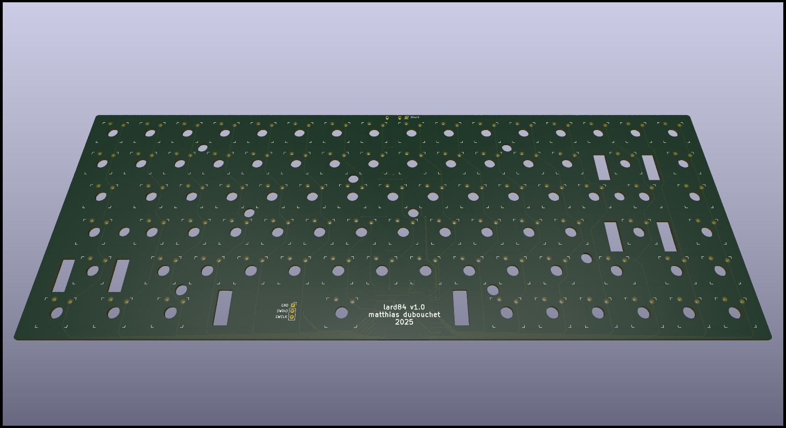
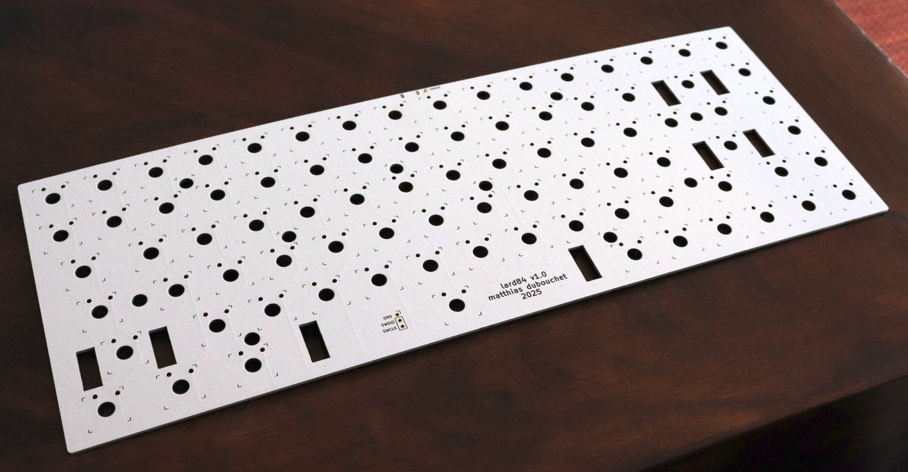

## Plate

The top plate (plate v38.f3z) supports the switches, adds rigidity and gives a nice finish. It was made in Fusion360.

It is a relatively simple design with a square cutout for each key, two extra cutouts around the Backspace, Space, Enter and LShift keys
for their plate-mounted stabilizers, and 10 mounting holes for screws.

One key challenge was to figure out the placement and shape for the stabilizer cutouts, because of insufficient information on
the datasheets from the manufacturer.

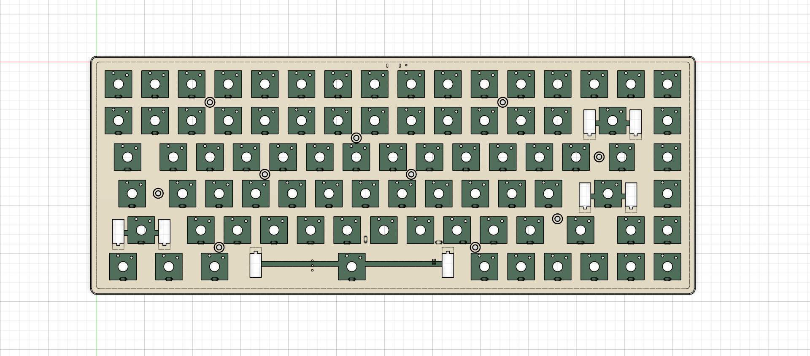
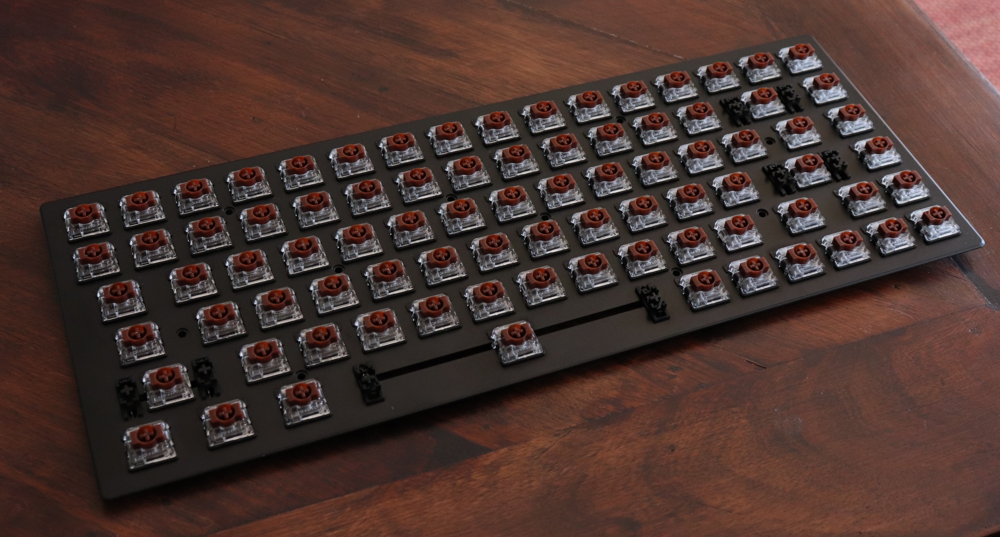

## Case

The case (case.FCStd) is a 3D-printable plastic enclosing and two feet for a more comfortable typing angle.

The enclosing features mounting posts for the PCB and plate, and anti-warping structural elements.

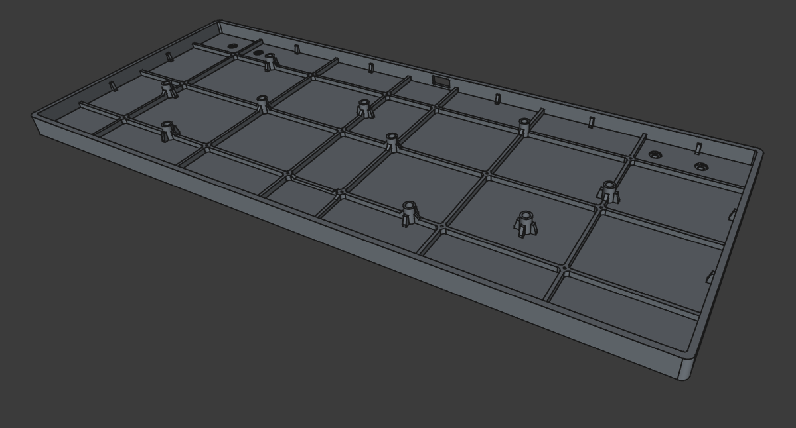
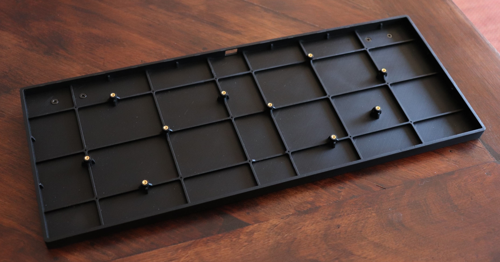

## Acknowledgments

Thanks to these open source repos for providing vital KiCad symbol/footprint libraries.
- [RP2350 Stamp](https://github.com/solderparty/rp2xxx_stamp_footprints)
- [Gateron switches](https://github.com/siderakb/key-switches.pretty)

## Extra pictures

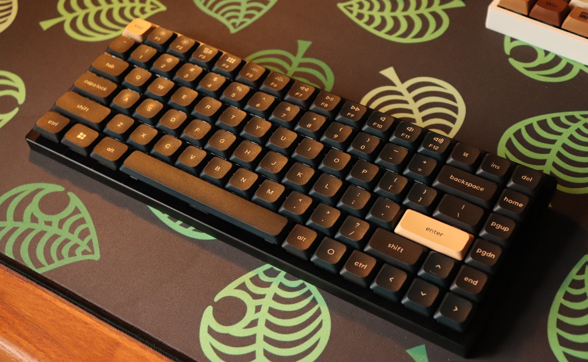
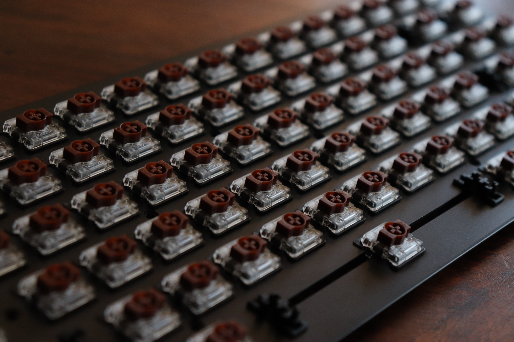
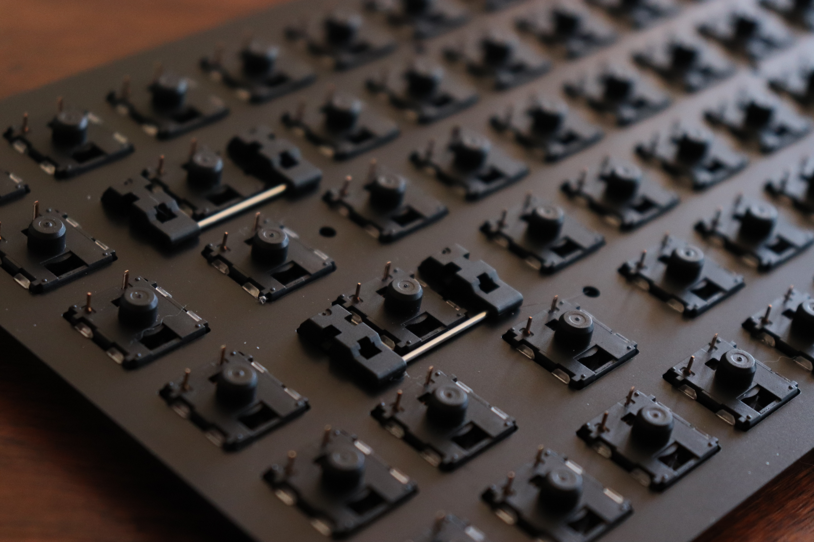
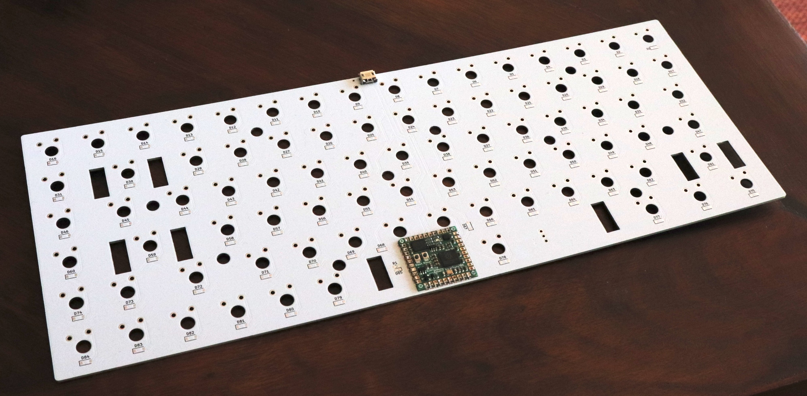
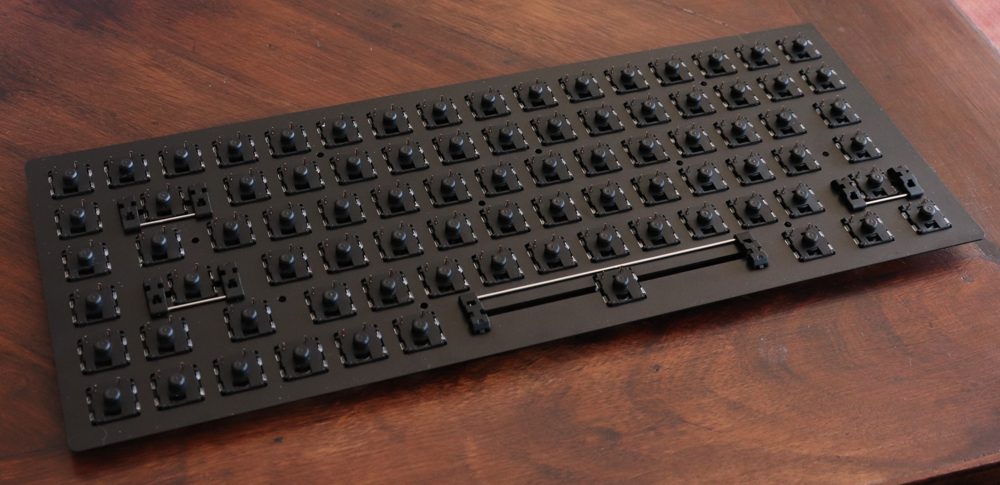
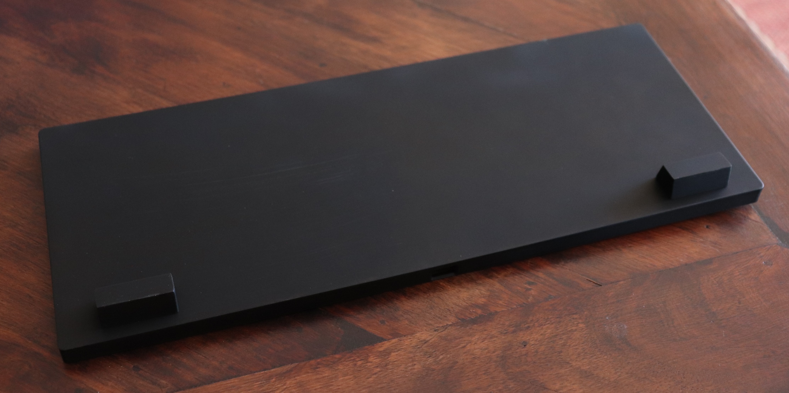
